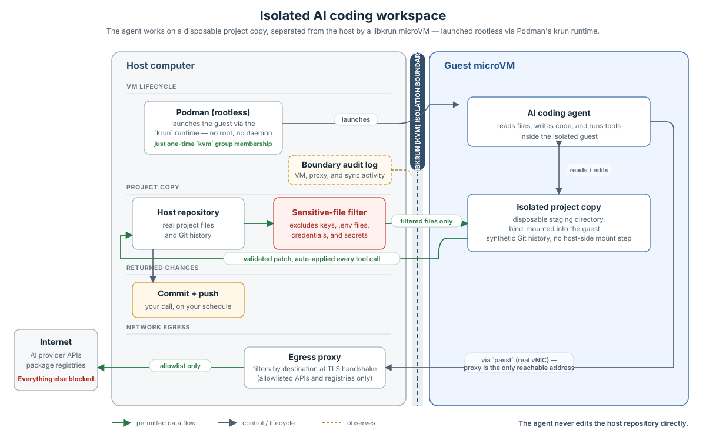
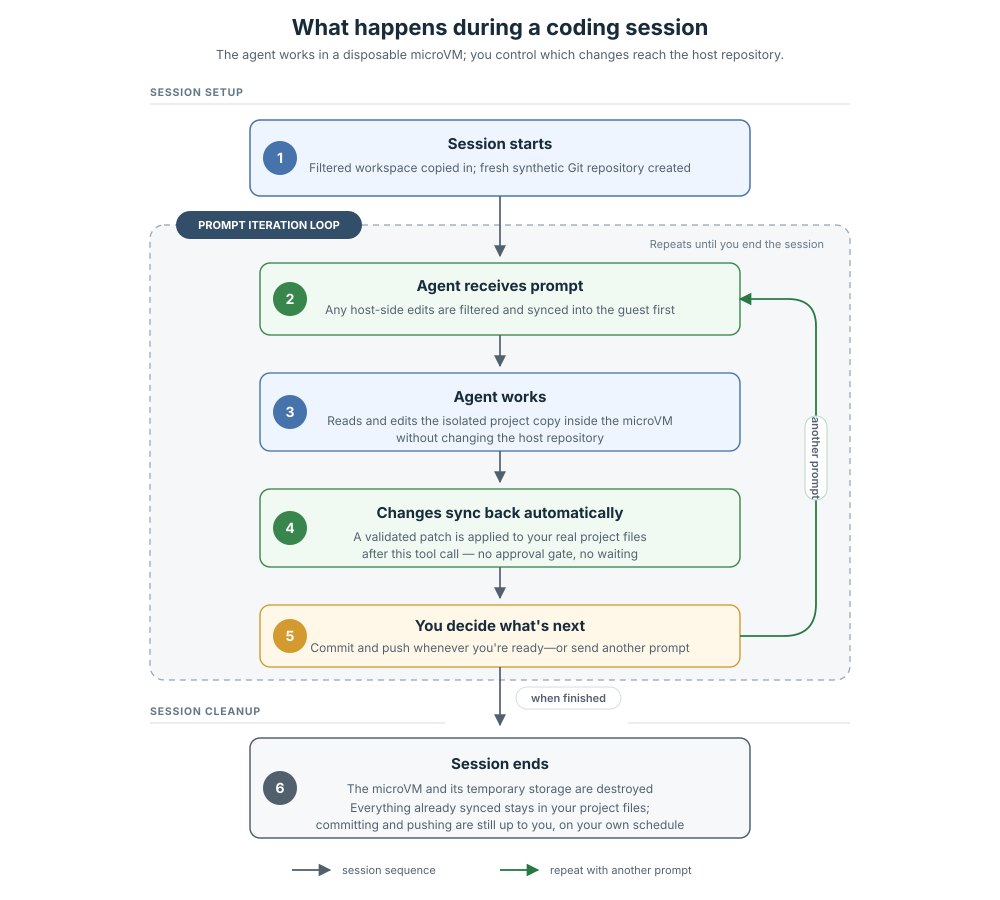

# Agent Habitat — Product Plan & Architecture

## Overview

Agent Habitat gives an AI coding agent its own disposable copy of your project to work in — a sealed sandbox that looks and feels like your real codebase, but isn't it.

The agent can read, edit, and run commands as much as it wants inside that sandbox. None of it touches your actual files. When you're happy with what it did, its changes come back to you as a normal patch that you review and commit — the same way any teammate's pull request would reach you. Nothing gets written into your project automatically.

Three things make this safe in practice:

- **A hard wall between the agent and your computer.** The agent runs inside a real virtual machine, not just a sandboxed folder — the kind of isolation used to run untrusted code safely at cloud-provider scale.
- **A locked front door to the internet.** The agent can only reach the handful of services it actually needs (AI provider APIs, package registries like PyPI and npm). Everything else is blocked.
- **Secrets never go in.** Credentials, API keys, and `.env` files are filtered out before the sandbox is even built — they never have the chance to leak, because they're never present.

Everything the agent does is logged, so there's always a clear record of what happened in a session.

**The host machine must be Linux in v1, and v1 specifically targets two host OS families in parallel: Fedora-based and Ubuntu-based distros** (covering the majority of rpm- and deb-based systems), with hardware virtualization available — not macOS or Windows. macOS and Windows host support is planned for later, once the Linux-host core is proven; it isn't scoped or designed yet.

**The guest is a separate, fixed thing: a minimal Alpine Linux image inside the sandbox** (see Section 2.1). It doesn't change with host-OS-family support, and it isn't on a distro roadmap of its own.

Here's how the pieces fit together:



And here's what a typical session looks like end to end:



The rest of this document goes into the technical details behind each part.

---

## 1. Goals

1. Real isolation — the agent cannot escape to your computer.
2. Best-practice hardening on both sides of that boundary.
3. A workspace the agent can freely edit, without ever touching your real files until you explicitly promote its changes.
4. Internet access limited to an allowlist (package registries, AI provider APIs).
5. A full log of what the agent actually did.
6. Your choice of whether the agent sees real git history or not.
7. Sensitive files (credentials, keys, `.env` files) never make it into the sandbox in the first place.

## 2. How it's built

### 2.1 The sandbox itself: a real virtual machine, not a shared-kernel container

Each session gets its own lightweight virtual machine (via Kata Containers + Firecracker), not just a Linux container. That matters because containers share a kernel with the host — a real VM boundary, backed by hardware virtualization, is a much harder wall to break through.

- The guest runs a minimal Alpine Linux image — small, fast to boot (~125ms), and with little for an attacker to work with even if something went wrong inside it.
- Firecracker (the VM engine) intentionally supports very little hardware emulation, which keeps its exposed surface small.
- Launching a session runs with elevated host privileges, which sounds alarming but is standard practice for this kind of infrastructure (it's how Kubernetes nodes work too) — the actual security boundary comes from the VM/kernel isolation, not from how the launcher itself is run.
- **Two things need to be true on your machine first:** hardware virtualization support (this can be silently unavailable on some cloud VMs — we'll check for it up front) and a second piece of infrastructure (containerd) installed alongside whatever you already use.
- This exact combination of technologies is newer and less battle-tested than more common setups, so it needs real hands-on validation before launch, not just a configuration change.

### 2.2 The workspace: how files move in, out, and back

**Storage.** Each session gets its own disposable virtual disk — never a direct link to your real folder. The agent works against that disk, and only that disk.

**Git history — your choice (Goal 6).** By default, the agent gets a brand-new, "synthetic" git repo seeded with just the current state of your files — so it can use git normally (diff, log, its own commits) without ever seeing your project's real history. If you'd rather it see the real history too, that's a toggle — the real `.git` gets shared in read-only.

**Keeping host and sandbox in sync.** Rather than a live, always-on file share (which would mean a background process constantly bridging the two sides — itself a security risk), Agent Habitat syncs at two clear moments:

- **After each tool call, sandbox → host.** If the agent changed anything, it's committed and sent back to your machine as a patch.
- **Before each prompt, host → sandbox.** If you changed anything on your machine, that change is sent into the sandbox before your prompt reaches the agent.
- Nothing happens if nothing changed — no empty syncs, no noise.
- Every patch is validated on arrival; a bad patch is flagged for review rather than silently merged.
- Not included in v1: the agent proactively asking to check your files mid-task, outside of these two moments. That's a likely future addition if it turns out to be needed.

**Keeping secrets out (Goal 7).** Before anything is copied into the sandbox — including the very first copy — files matching a security-focused blocklist (`.env`, `*.pem`, `*.key`, `id_rsa*`, cloud credential files, and similar) are stripped out. This list ships with sensible defaults and can be extended per project.

A few important nuances:
- This only blocks things from coming *in*. It doesn't restrict what the agent creates inside the sandbox — you're expected to review everything that comes back out, regardless of filename.
- There's no in-between option in v1: if a task genuinely needs a blocked file's contents (say, a runtime environment variable), it's just unavailable. A more targeted way to inject specific secrets without exposing the whole file is a likely future improvement.

**Bringing changes back.** After each tool call, the agent's changes are written directly into your real project folder — not just committed inside the sandbox, but applied to your actual working directory, so you can see and touch them immediately. From there, it's entirely up to you: keep editing by hand, send another prompt, or commit and push whenever you're ready. There's no forced "end of session" gate on committing — that's always a deliberate, manual step you take on your own schedule.

Ending the session is a separate, explicit action from committing: when you're done working with the agent, you end the session, and the disposable sandbox (its virtual disk and everything on it) is destroyed. Nothing is lost by this — anything the agent already pushed to your real folder is already there, whether or not you've committed it yet.

### 2.3 Internet access: locked down by default

All outbound traffic from the sandbox is routed through a local proxy, so the agent can't route around it. Filtering happens at the point where a secure connection is being negotiated — meaning it can tell *where* a connection is going without having to intercept and inspect the traffic itself, so tools that verify certificates still work normally.

By default, only major AI provider APIs and standard package registries (PyPI, npm, crates.io, etc.) are reachable. Anything else is blocked. This is extendable per project.

### 2.4 Auditing: a clear record of what crossed the line

Every session has its own monitoring watching the boundary between host and sandbox — the VM process, the proxy, and the sync mechanism. Because syncs only happen at well-defined moments (never continuously), each one shows up as a distinct, identifiable event rather than noise, making it easy to spot anything unusual.

**Honest scope note:** this covers what crosses the boundary — not every command the agent runs *inside* the sandbox. Full in-sandbox activity logging is a known gap, and a candidate fast-follow rather than something v1 claims to cover.

### 2.5 Day-to-day use

No extra service to run. From your side, it's one command:

```
habitat run -- claude-code
habitat run --config sandbox.yaml -- claude-code
```

A config file controls resource limits, the internet allowlist, whether git history is included, auditing on/off, and any project-specific additions to the secrets blocklist. It's meant to be checked into your repo so a team shares the same setup.

There's one hardened setup, not a "fast but less safe" mode and a "slow but safer" mode — settings adjust behavior, not the underlying security model.

## 3. Key decisions

| Decision | Chosen | Why |
|---|---|---|
| Virtual machine engine | Firecracker | No need for a live shared filesystem, so Firecracker's minimal hardware emulation is a straightforward security win; fast boot also suits short, disposable sessions. |
| Launch tooling | containerd + nerdctl (elevated privileges) | The alternatives (podman in various forms) either don't support this kind of VM launch on our target Linux distribution, or are actively broken upstream. This is the one fully-supported option, and matches how production infrastructure like Kubernetes already runs. |
| File sharing | A disposable virtual disk per session | Avoids a live, always-on file-sharing process between host and sandbox — removing that as a way to break out. Trade-off: no simultaneous live access, handled instead by the sync mechanism above. |
| Git history | Synthetic repo by default | The agent gets normal git tools without seeing real history; changes are reviewed either way before they reach you. |
| Syncing | Event-triggered, only when something changed | Reuses the same trusted patch mechanism as the final promotion step, instead of building a second one; keeps every sync as a clear, auditable event. |
| Secrets filtering | Separate blocklist, applied before anything leaves your machine | `.gitignore` answers a version-control question, not a security one — the two lists diverge in practice. Filtering has to happen before transfer, or the secret has already left. |
| Isolation model | One hardened setup | Easier to reason about and test than offering multiple security tiers. |
| Internet filtering | Filter by destination during connection setup | IP-based filtering breaks against services that rotate IPs; fully intercepting traffic would break certificate verification in agent tooling. |

## 4. Known limitations

- **Linux host only in v1.** Firecracker needs KVM, which means no native macOS or Windows support yet — running inside a nested VM (e.g. Docker Desktop/WSL2's own Linux VM) is not a supported path today. macOS and Windows are future work, not a v1 gap being papered over.
- **v1 validates two host distro families: Fedora-based and Ubuntu-based.** Other Linux distros (Arch, openSUSE, etc.) have the same underlying KVM/containerd/Kata requirements but aren't validated or officially supported until their own roadmap stage.
- **Hardware virtualization is required** and isn't always available on cloud machines — we check for this up front rather than failing at runtime.
- **A second piece of host infrastructure (containerd) is required**, alongside whatever a team already runs.
- **In-sandbox activity isn't logged in v1** — only what crosses the boundary. A candidate follow-up.
- **This exact technology combination is newer and less proven** — it needs real validation on real hardware before v1 ships.
- **The agent can't proactively check your files mid-task** — only at the two sync points described above.
- **Sync performance at large scale (huge monorepos, big binary files) isn't yet validated** — worth checking before v1 ships.
- **No middle ground for blocked files** — if a task needs a secret, it's simply unavailable in v1. A more targeted way to inject specific secrets is a likely future addition.
- Naming (`habitat` vs. alternatives) is still open.

## 5. Roadmap

**Guest (inside the sandbox):** fixed at a minimal Alpine Linux image throughout -- no distro roadmap of its own; see Section 2.1.

**Host OS family (the machine running `habitat`):**

1. **v1 -- Fedora-based and Ubuntu-based Linux distros, in parallel:** the full system described above, validated end-to-end on real hardware for both -- not one first and the other later. Together they cover the RPM and DEB package families.
2. **Future additions:** further host distro families (e.g. Arch, openSUSE) once both v1 host lines are proven out; macOS and Windows host support (a separate, later effort -- Firecracker/KVM needs a Linux kernel, so this needs its own isolation-model design, not just "more Linux distros"); full in-sandbox activity logging; the agent being able to check host files on demand; an optional live progress view; GPU support if it's ever needed.
